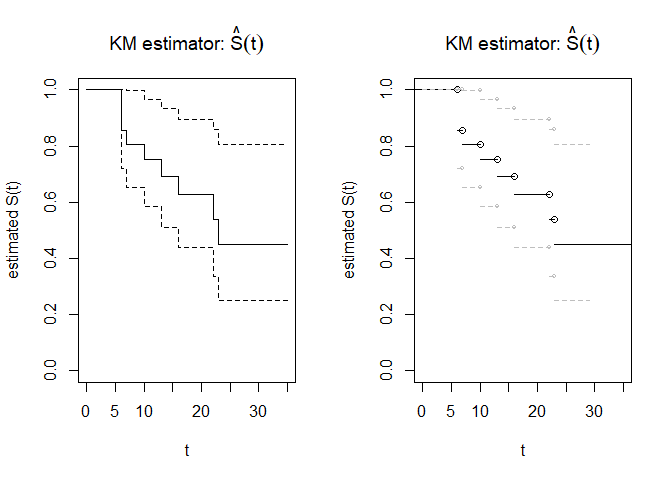
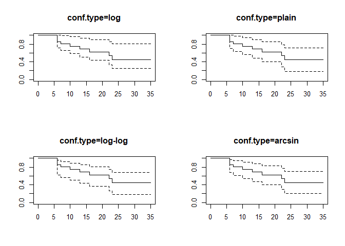
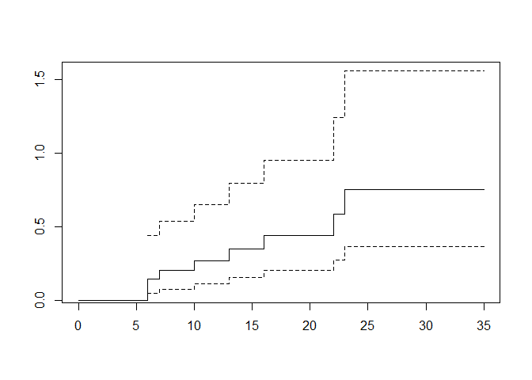

Ch4-1 estimation of right censored data
================
Li-Hsin Chien
2024-10-04

- [1 Kaplan-Meier(KM) estimator:
  $\hat{S}(t)$](#1-kaplan-meierkm-estimator-hatst)
- [2 Pointwise confidence intervals for
  $\hat{S}(t)$](#2-pointwise-confidence-intervals-for-hatst)
- [3 Prediction](#3-prediction)
- [4 Nelson-Aalen estimator (估計 cumulative hazard
  function)](#4-nelson-aalen-estimator-估計-cumulative-hazard-function)

# 1 Kaplan-Meier(KM) estimator: $\hat{S}(t)$

KM estimator $\hat{S}(t)$ 用無母數的方式估計存活函數 $S(t)$。

``` r
#install.packages("KMsurv")
library(KMsurv) #使用 KMsurv 套件裡的資料
data(drug6mp) #課本 Example 4.1
#?drug6mp
drug6mp
```

    ##    pair remstat t1 t2 relapse
    ## 1     1       1  1 10       1
    ## 2     2       2 22  7       1
    ## 3     3       2  3 32       0
    ## 4     4       2 12 23       1
    ## 5     5       2  8 22       1
    ## 6     6       1 17  6       1
    ## 7     7       2  2 16       1
    ## 8     8       2 11 34       0
    ## 9     9       2  8 32       0
    ## 10   10       2 12 25       0
    ## 11   11       2  2 11       0
    ## 12   12       1  5 20       0
    ## 13   13       2  4 19       0
    ## 14   14       2 15  6       1
    ## 15   15       2  8 17       0
    ## 16   16       1 23 35       0
    ## 17   17       1  5  6       1
    ## 18   18       2 11 13       1
    ## 19   19       2  4  9       0
    ## 20   20       2  1  6       0
    ## 21   21       2  8 10       0

*drug6mp* 的資料說明可以參考課本 Section 1.2。

我們要使用的資料為:

- *t2*: Time to relapse for 6-MP patients, months
  ($T$:觀測到的復發時間，包含 right censored data)

- *relapse*: Relapse indicator (0=censored, 1=relapse) for 6-MP patients
  ($\delta$)

計算 KM estimator 使用的指令為 survfit()，指令在 survival 套件中。

``` r
library(survival)
fit <- survfit(Surv(t2,relapse)~1, data=drug6mp)
summary(fit)
```

    ## Call: survfit(formula = Surv(t2, relapse) ~ 1, data = drug6mp)
    ## 
    ##  time n.risk n.event survival std.err lower 95% CI upper 95% CI
    ##     6     21       3    0.857  0.0764        0.720        1.000
    ##     7     17       1    0.807  0.0869        0.653        0.996
    ##    10     15       1    0.753  0.0963        0.586        0.968
    ##    13     12       1    0.690  0.1068        0.510        0.935
    ##    16     11       1    0.627  0.1141        0.439        0.896
    ##    22      7       1    0.538  0.1282        0.337        0.858
    ##    23      6       1    0.448  0.1346        0.249        0.807

- time: $t_i$, 發生 event 的時間點 (survival function jump 的時間點)。

- n.risk: $Y_i$, risk set 人數。在 $t_i^-$ 時還活著的人 (包含在 $t_i$
  發生 event 的人)。

- n.event: $d_i$, 在 $t_i$ 時間點發生 event 的人數。

- survival: $\hat{S}(t_i)$, KM estimator。

- std.err: $\hat{S}(t_i)$ 的 standard error (Greenwood’s formula)。

- lower 95% CI: $\hat{S}(t_i)$ 95% 信賴區間下界(conf.type=“log”)。

- upper 95% CI: $\hat{S}(t_i)$ 95% 信賴區間上界。

畫出 $\hat{S}(t)$

``` r
par(mfrow=c(1,2))
plot(fit, xlab="t",ylab="estimated S(t)",main=expression(paste("KM estimator: ",hat(S)(t))))

x0<-fit$time[fit$n.event>0]
y0<-c(1,fit$surv[fit$n.event>0])
sfun0<- stepfun(x0,y0,right=T)
plot(sfun0,verticals=F,ylim=c(0,1),xlim=c(0,max(drug6mp$t2)),xlab="t",ylab="estimated S(t)",main=expression(paste("KM estimator: ",hat(S)(t))))
sfun.ci1<- stepfun(x0,c(1,fit$upper[fit$n.event>0]),right=T)
sfun.ci2<- stepfun(x0,c(1,fit$lower[fit$n.event>0]),right=T)

plot(sfun.ci1,add=T,lty=2,vertical=F,cex=.5,col="gray")
plot(sfun.ci2,add=T,lty=2,vertical=F,cex=.5,col="gray")
```

<!-- -->

# 2 Pointwise confidence intervals for $\hat{S}(t)$

`conf.type` 可以選擇信賴區間種類:

- “plain”: no transformation

- “log” (default): $\log(S(t))=-H(t)$

- “log-log”: $\log (-\log (S(t)))$, range $=(\infty,\infty)$

- “arcsin”

``` r
fit.plain <- survfit(Surv(t2,relapse)~1, data=drug6mp,conf.type="plain")
fit.log_log <- survfit(Surv(t2,relapse)~1, data=drug6mp,conf.type="log-log")
fit.arcsin <- survfit(Surv(t2,relapse)~1, data=drug6mp,conf.type="arcsin")

par(mfrow=c(2,2))
plot(fit,main="conf.type=log")
plot(fit.plain,main="conf.type=plain")
plot(fit.log_log,main="conf.type=log-log")
plot(fit.arcsin,main="conf.type=arcsin")
```

<!-- -->

# 3 Prediction

給定 survival rate, 計算 quantile

``` r
quantile(fit, probs=1-0.8) # x: S(x)=.8
```

    ## $quantile
    ## 20 
    ## 10 
    ## 
    ## $lower
    ## 20 
    ##  6 
    ## 
    ## $upper
    ## 20 
    ## NA

``` r
quantile(fit, probs=1-.5) # median survival rate, x: S(x)=.5
```

    ## $quantile
    ## 50 
    ## 23 
    ## 
    ## $lower
    ## 50 
    ## 16 
    ## 
    ## $upper
    ## 50 
    ## NA

給定時間 10，預測 survival rate ( $\hat{S}(10)$ )

``` r
t_index <- min(which(fit$time>=10))
fit$surv[t_index]
```

    ## [1] 0.7529412

``` r
summary(fit,10)
```

    ## Call: survfit(formula = Surv(t2, relapse) ~ 1, data = drug6mp)
    ## 
    ##  time n.risk n.event survival std.err lower 95% CI upper 95% CI
    ##    10     15       5    0.753  0.0963        0.586        0.968

``` r
summary(fit)
```

    ## Call: survfit(formula = Surv(t2, relapse) ~ 1, data = drug6mp)
    ## 
    ##  time n.risk n.event survival std.err lower 95% CI upper 95% CI
    ##     6     21       3    0.857  0.0764        0.720        1.000
    ##     7     17       1    0.807  0.0869        0.653        0.996
    ##    10     15       1    0.753  0.0963        0.586        0.968
    ##    13     12       1    0.690  0.1068        0.510        0.935
    ##    16     11       1    0.627  0.1141        0.439        0.896
    ##    22      7       1    0.538  0.1282        0.337        0.858
    ##    23      6       1    0.448  0.1346        0.249        0.807

# 4 Nelson-Aalen estimator (估計 cumulative hazard function)

*survfit* 指令中，cumulative hazard function 的估計方式預設值為
Nelson-Aalen estimator，估計的結果存在 *cumhaz* 中。

``` r
#?survfit.object #查詢 survfit 指令有哪些 output
names(summary(fit))
```

    ##  [1] "n"             "time"          "n.risk"        "n.event"      
    ##  [5] "n.censor"      "surv"          "std.err"       "cumhaz"       
    ##  [9] "std.chaz"      "type"          "logse"         "conf.int"     
    ## [13] "conf.type"     "lower"         "upper"         "call"         
    ## [17] "table"         "rmean.endtime"

``` r
plot(fit,fun="cumhaz")
```

<!-- -->

``` r
data.frame(fit$time,fit$n.risk,fit$n.event,fit$cumhaz)
```

    ##    fit.time fit.n.risk fit.n.event fit.cumhaz
    ## 1         6         21           3  0.1428571
    ## 2         7         17           1  0.2016807
    ## 3         9         16           0  0.2016807
    ## 4        10         15           1  0.2683473
    ## 5        11         13           0  0.2683473
    ## 6        13         12           1  0.3516807
    ## 7        16         11           1  0.4425898
    ## 8        17         10           0  0.4425898
    ## 9        19          9           0  0.4425898
    ## 10       20          8           0  0.4425898
    ## 11       22          7           1  0.5854469
    ## 12       23          6           1  0.7521136
    ## 13       25          5           0  0.7521136
    ## 14       32          4           0  0.7521136
    ## 15       34          2           0  0.7521136
    ## 16       35          1           0  0.7521136
